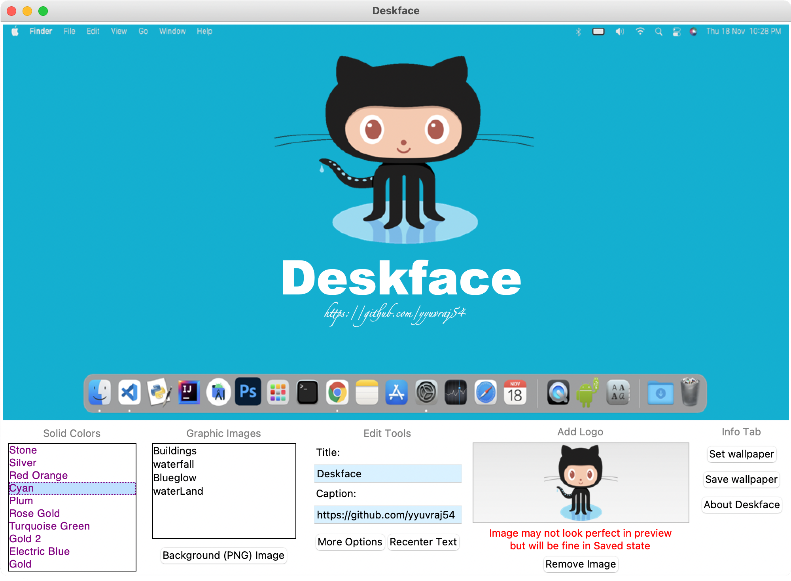

# Deskface
Deskface is a quick wallpaper customizer that is
developed in python3 using Tkinter and Pillow Library.

## About Deskface
We can add title and caption into our selected wallpaper (alredy Installed/Imported) and can also add logo with a live preview in Deskface with all font,color and size option in Deskface

## Screenshots
🖥 Deskface main interface

After set wallpaer

## About Developer

Design and Developed by Yuvraj Singh Yadav

- [Github](https://github.com/yyuvraj54)

